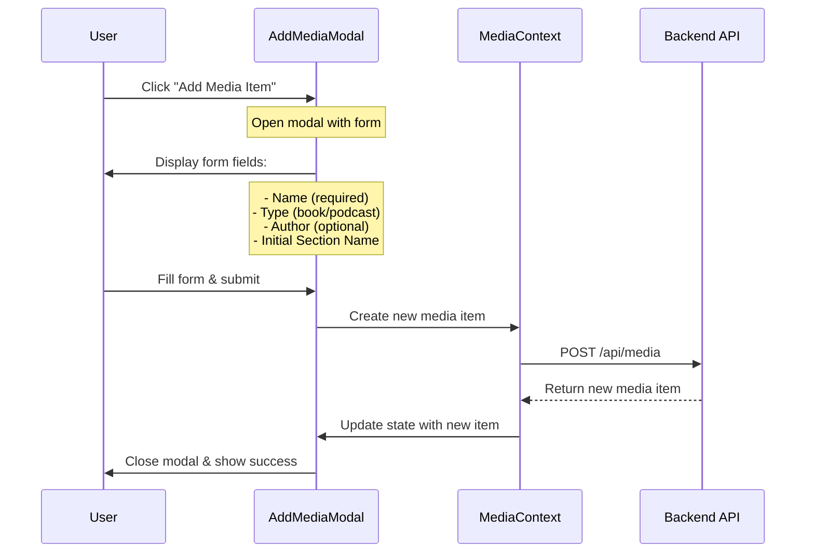

# Add Media Item Implementation Plan

## Overview
This document outlines the plan for implementing the "Add Media Item" functionality in the Notaverse application. The feature will allow users to add new media items (books or podcasts) with initial section information.

## User Flow


## Implementation Steps

### 1. Create AddMediaModal Component
- Create new file: `client/src/components/media/AddMediaModal.tsx`
- Components needed:
  - Modal container (using shadcn/ui)
  - Form with fields:
    - Name (required)
    - Type selector (book/podcast)
    - Author (optional)
    - Initial section name
  - Form validation
  - Submit/Cancel buttons
  - Loading state indicator
  - Error message display

### 2. Fix MediaContext Issues
- Current issues:
  - Action type 'MEDIA' should be 'SET_MEDIA'
  - MediaSection type in useMediaOperations should be MediaItem
  - Missing create media item action
- Updates needed:
  - Fix action types
  - Add new action: 'CREATE_MEDIA'
  - Add loading states for API operations
  - Update useMediaOperations hook with create function

### 3. API Integration
- New endpoint required: POST /api/media
- Request body structure:
```typescript
interface CreateMediaRequest {
  name: string;
  type: 'book' | 'podcast';
  author?: string;
  initialSection: {
    name: string;
    order: number;
  };
}
```
- Error handling:
  - Duplicate media names
  - Invalid media types
  - Missing required fields
  - Server errors

### 4. MediaLibrary Component Updates
- Wire up "Add Media Item" button to modal
- Add loading states:
  - Disable add button during submission
  - Show loading indicator
- Handle errors:
  - Display error messages
  - Allow retry on failure
- Refresh list after successful creation

### 5. UX Enhancements
- Form field tooltips:
  - Name: "Enter the title of your book or podcast"
  - Type: "Select whether this is a book or podcast"
  - Author: "Optional: Enter the author or creator's name"
  - Section: "Enter the name of the first section (e.g., chapter name)"
- Validation rules:
  - Name: Required, min 2 chars, max 100 chars
  - Type: Required, must be 'book' or 'podcast'
  - Author: Optional, max 100 chars
  - Section: Required, min 2 chars, max 100 chars
- Keyboard navigation:
  - Escape to close modal
  - Enter to submit form
  - Tab navigation between fields
- Success feedback:
  - Toast notification on successful creation
  - Automatic modal close
  - Scroll to new item in list

## Type Definitions
```typescript
// New action type for MediaContext
type MediaAction =
  | { type: 'SET_MEDIA'; payload: MediaItem }
  | { type: 'CREATE_MEDIA'; payload: MediaItem }
  | { type: 'SET_LOADING'; payload: boolean }
  | { type: 'SET_ERROR'; payload: string }
  | { type: 'CLEAR_MEDIA' };

// Form data type
interface AddMediaFormData {
  name: string;
  type: MediaType;
  author?: string;
  initialSection: string;
}
```

## Testing Considerations
- Unit tests:
  - Form validation
  - MediaContext actions
  - API integration
- Integration tests:
  - Complete add flow
  - Error handling
  - State updates
- E2E tests:
  - User flow
  - Form submission
  - Success/error cases

## Future Enhancements
- Bulk media import
- Media file upload
- Template selection for common media types
- Section template creation
- Rich text input for descriptions