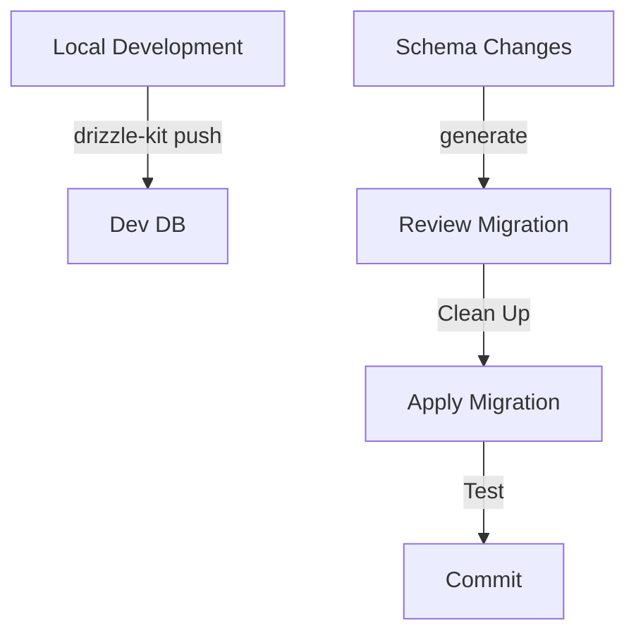

# Database Migrations Guide

## Current Issues with SQLite/LibSQL Migrations

### Duplicate Index Problem

We encountered an issue where unique indexes were being created twice in migrations. This happens due to how Drizzle Kit handles SQLite migrations with unique constraints.

Example of problematic migration:
```sql
ALTER TABLE `__new_users` RENAME TO `users`;
CREATE UNIQUE INDEX `users_email_unique` ON `users` (`email`);
CREATE UNIQUE INDEX `users_email_unique` ON `users` (`email`);
```

This occurs because:
1. The schema defines a unique constraint using `.unique()`
2. SQLite's table recreation pattern adds another index
3. Drizzle Kit generates separate index creation

### Best Practices for Index Creation

1. **Preferred Schema Definition:**
```typescript
// Option 1: Use column options
export const users = sqliteTable('users', {
  email: text('email', { unique: true }).notNull(),
});

// Option 2: Use PRIMARY KEY if applicable
export const users = sqliteTable('users', {
  email: text('email').notNull().primaryKey(),
});
```

2. **Migration Process:**
```bash
# Generate migrations
drizzle-kit generate:sqlite

# IMPORTANT: Review generated SQL files
# Remove any duplicate constraints before applying

# Apply migrations
drizzle-kit push:sqlite
```

## Detailed Migration Workflows

### Development Environment

1. **Local Development Flow**
```bash
# 1. Make changes to schema.ts

# 2. Push changes directly to development database
pnpm db:push   # runs drizzle-kit push:sqlite
# This is safe in development as it directly updates the schema

# 3. When ready to create a migration for version control:
pnpm db:generate  # runs drizzle-kit generate:sqlite
# Review generated migrations in server/src/db/migrations/

# 4. Test the migration locally
pnpm db:migrate  # runs drizzle-kit up:sqlite
```

2. **Local Testing Process**
```bash
# Create a test database
cp server/src/notaverse.db server/src/notaverse.test.db

# Run migrations on test database
DATABASE_URL="file:./notaverse.test.db" pnpm db:migrate

# Verify data and schema
sqlite3 server/src/notaverse.test.db ".schema"
```

### Production Environment

> Note: Some of the following features are planned for future implementation. Currently, many of these steps need to be performed manually.

1. **Current Production Process**
```bash
# 1. Manual backup of production database
# Keep a copy of your database file

# 2. Apply migrations carefully
drizzle-kit up:sqlite

# 3. Manual verification
# Check schema and data integrity
```

2. **Planned Production Features**
```bash
# Future implementation will include:
pnpm db:backup           # Automated backup
pnpm db:migrate:prod     # Migration with retry logic
pnpm db:verify:prod      # Automated verification
pnpm db:rollback        # Automated rollback
```

3. **Current Rollback Process**
```bash
# Until automated rollback is implemented:
# 1. Keep backup before migration
# 2. Document exact changes made
# 3. Prepare manual rollback SQL if needed
# 4. Test rollback process in development
```

> Important: Until automated features are implemented, maintain detailed documentation of each migration step and ensure manual backups are created before any production changes.

### Available Scripts and Future Features

#### Currently Available Scripts
```json
{
  "scripts": {
    "db:generate": "npx drizzle-kit generate",    // Generate new migrations
    "db:migrate": "npx drizzle-kit migrate",      // Apply pending migrations
    "db:push": "npx drizzle-kit push",           // Push schema changes to dev DB
    "db:studio": "npx drizzle-kit studio",       // Open Drizzle Studio UI
    "db:drop": "npx drizzle-kit drop",           // Drop all tables (use with caution)
    "db:backup": "bash scripts/backup-turso.sh"   // Backup Turso database
  }
}
```

#### Script Usage Guide
1. Development Workflow:
   - Use `db:push` during active development to quickly update schema
   - Use `db:generate` when ready to create migration files
   - Use `db:migrate` to apply migrations
   - Use `db:studio` to visually inspect your database
   - Use `db:backup` before making significant changes

2. Safety Notes:
   - `db:drop` should ONLY be used in development
   - Always run `db:backup` before significant changes
   - Use `db:studio` to verify changes after migrations

#### Planned Future Features
1. `migrate-with-retries.js`: Will implement retry logic and timeout handling for production migrations
2. `verify-migration.js`: Will verify schema and data integrity after migrations
3. `rollback-migration.js`: Will provide automated rollback functionality
4. Backup scripts will be enhanced with better error handling and validation

Until these features are implemented, please:
- Manually verify migrations after applying
- Keep manual backups before migrations
- Document any changes that need to be rolled back
- Test thoroughly in development before production deployment

### Migration Best Practices

1. **Development Best Practices**
   - Use `db:push` for rapid development only
   - Always generate and review migrations before committing
   - Use Drizzle Studio (`db:studio`) to verify changes
   - Keep development database in sync with schema

2. **Production Safety**
   - Never use `db:push` or `db:drop` in production
   - Always run `db:backup` before migrations
   - Test migrations locally first
   - Document each migration's changes
   - Keep backups until changes are verified

3. **Migration Process**
   - Make schema changes in schema.ts
   - Test changes with `db:push` locally
   - Generate migration with `db:generate`
   - Review generated SQL carefully
   - Test migration with `db:migrate` locally
   - Commit and deploy when verified

4. **Maintenance**
   - Regularly test backup/restore process
   - Keep migration documentation up to date
   - Monitor database performance after changes
   - Clean up old backups periodically

### Other Options
1. **Neon**
   - Native PostgreSQL
   - Serverless-ready
   - Built-in branching
   - Generous free tier

2. **PlanetScale**
   - Non-blocking schema changes
   - Deploy previews
   - Schema change workflow

3. **Supabase**
   - Full Postgres features
   - Auto-generated APIs
   - Built-in migration tools

4. **Xata**
   - Automatic schema migrations
   - Branch-based development
   - TypeScript integration

## Migration Strategy Recommendations

1. **Development Workflow**


2. **Best Practices**
   - Keep schema.ts as source of truth
   - Review generated migrations before applying
   - Test migrations in staging environment
   - Maintain separate branches for schema changes
   - Document all schema decisions

3. **Testing Migrations**
   - Create test database for migration validation
   - Run migrations on copy of production data
   - Verify foreign key constraints
   - Test rollback procedures
   - Validate data integrity after migration

4. **Production Deployment**
   - Always backup before migrating
   - Use transactions when possible
   - Have rollback plan ready
   - Monitor migration execution
   - Verify indexes after migration

## Immediate Action Items

1. **Fix Current Schema**
   - Update unique constraints in schema.ts
   - Regenerate clean migrations
   - Test on development database

2. **Improve Process**
   - Implement migration review step
   - Create migration test environment
   - Document migration procedures

3. **Consider Migration**
   - Evaluate Railway or other PostgreSQL solutions
   - Plan data migration strategy
   - Test migration process
   - Document new workflow

Remember: Always review generated migrations carefully before applying them to any environment, especially when dealing with unique constraints and indexes.